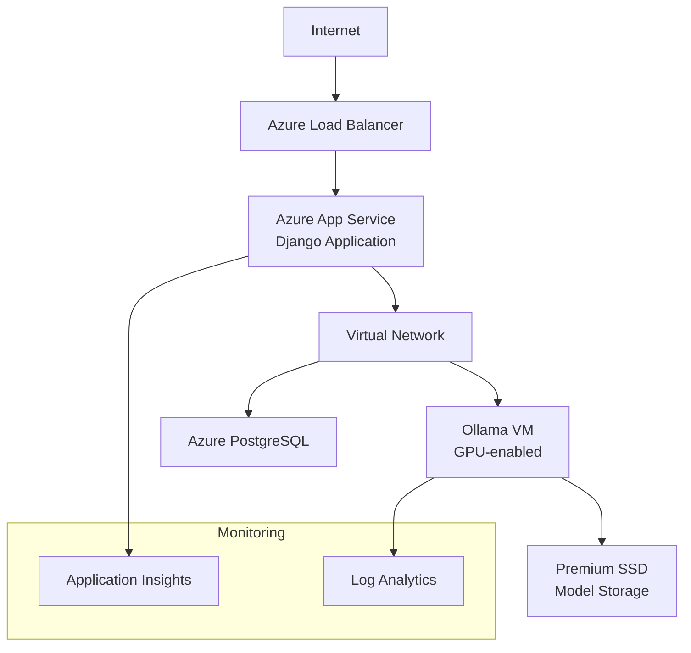
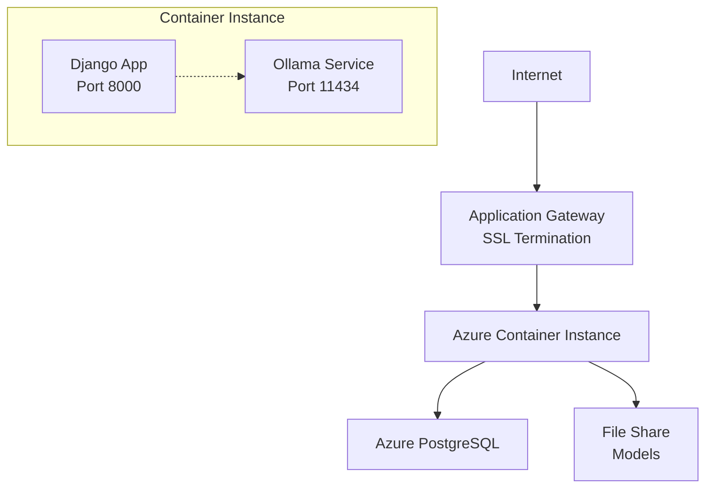

# 🏗️ Guia de Arquitetura: Ollama em Produção

Este documento apresenta as **melhores práticas** para implementar Ollama em ambientes de produção, com foco na arquitetura Azure.

## 📋 **Índice**
- [Visão Geral](#visão-geral)
- [Arquiteturas Recomendadas](#arquiteturas-recomendadas)
- [Infraestrutura Azure](#infraestrutura-azure)
- [Segurança e Rede](#segurança-e-rede)
- [Performance e Escalabilidade](#performance-e-escalabilidade)
- [Deployment e CI/CD](#deployment-e-cicd)
- [Monitoramento e Alertas](#monitoramento-e-alertas)
- [Considerações de Custo](#considerações-de-custo)
- [Migração Estratégica](#migração-estratégica)

---

## 🎯 **Visão Geral**

### **Ollama vs APIs SaaS**

| Aspecto | Ollama Local | APIs SaaS (Databricks) |
|---------|--------------|-------------------------|
| **Controle** | Total | Limitado |
| **Compliance** | Máximo | Depende do provedor |
| **Custo Inicial** | Alto | Baixo |
| **Custo Longo Prazo** | Previsível | Variável por uso |
| **Manutenção** | Alta | Mínima |
| **Escalabilidade** | Manual | Automática |
| **Time-to-Market** | Lento | Rápido |

### **Quando Escolher Ollama**

- ✅ **Compliance rigoroso** (dados sensíveis)
- ✅ **Controle total** sobre modelos
- ✅ **Previsibilidade de custos**
- ✅ **Customização de modelos**
- ✅ **Latência ultra-baixa**

---

## 🏗️ **Arquiteturas Recomendadas**

### **Arquitetura 1: Serviços Separados (RECOMENDADO)**



#### **Vantagens:**

- 🔒 **Isolamento de segurança**
- 📈 **Escalabilidade independente**
- 🛠️ **Manutenção simplificada**
- 💰 **Otimização de custos**

#### **Componentes:**

- **Frontend**: Azure App Service (Django)
- **AI Engine**: VM dedicada com Ollama
- **Database**: Azure PostgreSQL
- **Network**: Virtual Network com subnets privadas

---

### **Arquitetura 2: Container Unificado**



#### **Vantagens:**

- 🚀 **Deploy simplificado**
- 💵 **Menor custo inicial**
- 🎯 **Ideal para MVPs**

#### **Desvantagens:**

- ⚠️ **Acoplamento alto**
- 📊 **Escalabilidade limitada**
- 🔧 **Manutenção complexa**

---

## ☁️ **Infraestrutura Azure**

### **Especificações por Ambiente**

#### **Desenvolvimento**
```yaml
Ollama VM:
  - Size: Standard_D2s_v3 (2 vCPUs, 8GB RAM)
  - Storage: Standard SSD 128GB
  - OS: Ubuntu 22.04 LTS
  - GPU: Não necessária

Django App Service:
  - Tier: Basic B1
  - Instance: 1
```

#### **Produção**
```yaml
Ollama VM:
  - Size: Standard_NC6s_v3 (6 vCPUs, 112GB RAM)
  - GPU: Tesla V100 (16GB VRAM)
  - Storage: Premium SSD 512GB
  - OS: Ubuntu 22.04 LTS

Django App Service:
  - Tier: Standard S2
  - Instances: 2-5 (auto-scaling)
```

### **Configuração de Rede**

```yaml
Virtual Network:
  Address Space: 10.0.0.0/16
  
Subnets:
  - Public Subnet: 10.0.1.0/24
    - Application Gateway
    - NAT Gateway
    
  - App Subnet: 10.0.2.0/24
    - App Service Integration
    
  - AI Subnet: 10.0.3.0/24
    - Ollama VMs
    - Private endpoints
    
  - Data Subnet: 10.0.4.0/24
    - PostgreSQL
    - Storage accounts

Network Security Groups:
  - Web-NSG: Allow 80/443 from Internet
  - App-NSG: Allow 8000 from Web subnet
  - AI-NSG: Allow 11434 from App subnet
  - Data-NSG: Allow 5432 from App subnet
```

---

## 🔐 **Segurança e Rede**

### **Autenticação e Autorização**

#### **API Key Management**
```python
# settings.py
OLLAMA_CONFIG = {
    'BASE_URL': config('OLLAMA_BASE_URL'),
    'API_KEY': config('OLLAMA_API_KEY'),  # Stored in Key Vault
    'TIMEOUT': 120,
    'MAX_RETRIES': 3,
    'SSL_VERIFY': True
}

# Key Vault integration
from azure.keyvault.secrets import SecretClient
from azure.identity import DefaultAzureCredential

def get_ollama_api_key():
    credential = DefaultAzureCredential()
    client = SecretClient(
        vault_url="https://your-keyvault.vault.azure.net/",
        credential=credential
    )
    return client.get_secret("ollama-api-key").value
```

#### **NGINX Proxy Configuration**
```nginx
# /etc/nginx/sites-available/ollama
server {
    listen 443 ssl http2;
    server_name ollama-internal.yourdomain.com;
    
    ssl_certificate /etc/ssl/certs/ollama.crt;
    ssl_certificate_key /etc/ssl/private/ollama.key;
    
    # Security headers
    add_header X-Content-Type-Options nosniff;
    add_header X-Frame-Options DENY;
    add_header X-XSS-Protection "1; mode=block";
    
    # Rate limiting
    limit_req_zone $binary_remote_addr zone=ollama:10m rate=10r/m;
    
    location /api/ {
        limit_req zone=ollama burst=5;
        
        # API Key validation
        if ($http_authorization != "Bearer your-secure-token") {
            return 401;
        }
        
        proxy_pass http://127.0.0.1:11434;
        proxy_set_header Host $host;
        proxy_set_header X-Real-IP $remote_addr;
        proxy_read_timeout 300s;
        proxy_connect_timeout 30s;
    }
    
    # Health check endpoint
    location /health {
        access_log off;
        return 200 "healthy\n";
        add_header Content-Type text/plain;
    }
}
```

### **Firewall Rules**
```bash
# UFW Configuration
ufw default deny incoming
ufw default allow outgoing
ufw allow 22/tcp    # SSH (restrict to VPN)
ufw allow 443/tcp   # HTTPS
ufw deny 11434/tcp  # Block direct Ollama access
ufw enable
```

---

## ⚡ **Performance e Escalabilidade**

### **Configurações de Performance Ollama**

#### **Environment Variables**
```bash
# /etc/systemd/system/ollama.service
[Unit]
Description=Ollama Service
After=network.target

[Service]
Type=simple
User=ollama
Environment="OLLAMA_HOST=0.0.0.0:11434"
Environment="OLLAMA_NUM_PARALLEL=4"
Environment="OLLAMA_MAX_LOADED_MODELS=2"
Environment="OLLAMA_FLASH_ATTENTION=1"
Environment="CUDA_VISIBLE_DEVICES=0"
ExecStart=/usr/local/bin/ollama serve
Restart=on-failure
RestartSec=5

[Install]
WantedBy=multi-user.target
```

#### **Docker Configuration**
```dockerfile
FROM ollama/ollama:latest

# Otimizações de performance
ENV OLLAMA_NUM_PARALLEL=4
ENV OLLAMA_MAX_LOADED_MODELS=2
ENV OLLAMA_FLASH_ATTENTION=1

# GPU support
ENV NVIDIA_VISIBLE_DEVICES=all
ENV NVIDIA_DRIVER_CAPABILITIES=compute,utility

# Health check
HEALTHCHECK --interval=30s --timeout=10s --start-period=5s \
  CMD curl -f http://localhost:11434/api/tags || exit 1

EXPOSE 11434
CMD ["ollama", "serve"]
```

### **Auto-Scaling Strategy**

#### **VM Scale Set Configuration**
```yaml
# ARM Template excerpt
vmScaleSet:
  sku:
    name: Standard_NC6s_v3
    capacity: 2
  
  upgradePolicy:
    mode: Rolling
    
  automaticRepairsPolicy:
    enabled: true
    gracePeriod: PT30M
    
  scaleInPolicy:
    rules:
      - Default
      - OldestVM
```

#### **Custom Metrics for Scaling**
```python
# Custom metric collection
import psutil
import GPUtil
from azure.monitor.ingestion import LogsIngestionClient

def collect_ollama_metrics():
    metrics = {
        'timestamp': datetime.utcnow().isoformat(),
        'cpu_percent': psutil.cpu_percent(),
        'memory_percent': psutil.virtual_memory().percent,
        'gpu_utilization': GPUtil.getGPUs()[0].load * 100,
        'gpu_memory_used': GPUtil.getGPUs()[0].memoryUsed,
        'active_models': get_loaded_models_count(),
        'queue_length': get_request_queue_length()
    }
    
    # Send to Azure Monitor
    logs_client.upload(
        rule_id="dcr-ollama-metrics",
        stream_name="Custom-OllamaMetrics",
        logs=[metrics]
    )
```

---

## 🚀 **Deployment e CI/CD**

### **Azure DevOps Pipeline**

```yaml
# azure-pipelines.yml
trigger:
  branches:
    include:
    - main
  paths:
    include:
    - ollama/*
    - infrastructure/*

variables:
  azureSubscription: 'your-service-connection'
  resourceGroup: 'rg-ollama-prod'
  vmssName: 'vmss-ollama'

stages:
- stage: Build
  jobs:
  - job: BuildOllamaImage
    pool:
      vmImage: 'ubuntu-latest'
    steps:
    - task: Docker@2
      displayName: 'Build Ollama Image'
      inputs:
        containerRegistry: 'your-acr'
        repository: 'ollama-prod'
        command: 'buildAndPush'
        Dockerfile: 'ollama/Dockerfile'
        tags: |
          $(Build.BuildNumber)
          latest

- stage: Infrastructure
  dependsOn: Build
  jobs:
  - job: DeployInfrastructure
    pool:
      vmImage: 'ubuntu-latest'
    steps:
    - task: AzureResourceManagerTemplateDeployment@3
      inputs:
        deploymentScope: 'Resource Group'
        azureResourceManagerConnection: '$(azureSubscription)'
        subscriptionId: 'your-subscription-id'
        action: 'Create Or Update Resource Group'
        resourceGroupName: '$(resourceGroup)'
        location: 'East US'
        templateLocation: 'Linked artifact'
        csmFile: 'infrastructure/ollama-infra.json'
        csmParametersFile: 'infrastructure/parameters.json'

- stage: Deploy
  dependsOn: Infrastructure
  jobs:
  - job: DeployOllama
    pool:
      vmImage: 'ubuntu-latest'
    steps:
    - task: AzureCLI@2
      displayName: 'Update VMSS with new image'
      inputs:
        azureSubscription: '$(azureSubscription)'
        scriptType: 'bash'
        scriptLocation: 'inlineScript'
        inlineScript: |
          # Update VMSS model
          az vmss update \
            --resource-group $(resourceGroup) \
            --name $(vmssName) \
            --set virtualMachineProfile.storageProfile.imageReference.version=$(Build.BuildNumber)
          
          # Rolling update
          az vmss update-instances \
            --resource-group $(resourceGroup) \
            --name $(vmssName) \
            --instance-ids "*"

- stage: Test
  dependsOn: Deploy
  jobs:
  - job: HealthCheck
    pool:
      vmImage: 'ubuntu-latest'
    steps:
    - task: AzureCLI@2
      displayName: 'Health Check'
      inputs:
        azureSubscription: '$(azureSubscription)'
        scriptType: 'bash'
        scriptLocation: 'inlineScript'
        inlineScript: |
          # Wait for deployment
          sleep 60
          
          # Test health endpoint
          response=$(curl -s -o /dev/null -w "%{http_code}" https://ollama-internal.yourdomain.com/health)
          if [ $response -eq 200 ]; then
            echo "Health check passed"
          else
            echo "Health check failed with status: $response"
            exit 1
          fi
```

### **Ansible Playbook para Configuração**

```yaml
# playbooks/ollama-setup.yml
---
- name: Configure Ollama Production Environment
  hosts: ollama_servers
  become: yes
  vars:
    ollama_version: "0.1.32"
    models_to_download:
      - llama2:7b
      - codellama:7b
      
  tasks:
    - name: Update system packages
      apt:
        update_cache: yes
        upgrade: yes
        
    - name: Install required packages
      apt:
        name:
          - curl
          - nginx
          - certbot
          - python3-certbot-nginx
          - htop
          - iotop
        state: present
        
    - name: Download and install Ollama
      shell: |
        curl -fsSL https://ollama.ai/install.sh | sh
      args:
        creates: /usr/local/bin/ollama
        
    - name: Create ollama user
      user:
        name: ollama
        system: yes
        shell: /bin/false
        home: /var/lib/ollama
        
    - name: Create systemd service
      template:
        src: ollama.service.j2
        dest: /etc/systemd/system/ollama.service
      notify:
        - reload systemd
        - restart ollama
        
    - name: Configure NGINX
      template:
        src: nginx-ollama.conf.j2
        dest: /etc/nginx/sites-available/ollama
      notify:
        - restart nginx
        
    - name: Enable NGINX site
      file:
        src: /etc/nginx/sites-available/ollama
        dest: /etc/nginx/sites-enabled/ollama
        state: link
      notify:
        - restart nginx
        
    - name: Start and enable services
      systemd:
        name: "{{ item }}"
        state: started
        enabled: yes
      loop:
        - ollama
        - nginx
        
    - name: Download AI models
      shell: |
        ollama pull {{ item }}
      loop: "{{ models_to_download }}"
      become_user: ollama
      
  handlers:
    - name: reload systemd
      systemd:
        daemon_reload: yes
        
    - name: restart ollama
      systemd:
        name: ollama
        state: restarted
        
    - name: restart nginx
      systemd:
        name: nginx
        state: restarted
```

---

## 📊 **Monitoramento e Alertas**

### **Azure Monitor Configuration**

#### **Custom Metrics Dashboard**
```json
{
  "dashboard": {
    "title": "Ollama Production Dashboard",
    "tiles": [
      {
        "title": "GPU Utilization",
        "type": "metrics",
        "query": "customMetrics | where name == 'gpu_utilization'"
      },
      {
        "title": "Response Time",
        "type": "metrics", 
        "query": "requests | summarize avg(duration) by bin(timestamp, 5m)"
      },
      {
        "title": "Active Models",
        "type": "metrics",
        "query": "customMetrics | where name == 'active_models'"
      },
      {
        "title": "Error Rate",
        "type": "metrics",
        "query": "exceptions | summarize count() by bin(timestamp, 5m)"
      }
    ]
  }
}
```

#### **Alert Rules**
```yaml
# ARM Template for alerts
alertRules:
  - name: "High GPU Utilization"
    severity: 2
    condition:
      query: "customMetrics | where name == 'gpu_utilization' | where value > 85"
      timeAggregation: "Average"
      threshold: 85
      operator: "GreaterThan"
    
  - name: "Ollama Service Down"
    severity: 1
    condition:
      query: "heartbeat | where Computer contains 'ollama' | summarize LastHeartbeat = max(TimeGenerated) by Computer | where LastHeartbeat < ago(5m)"
      
  - name: "High Response Time"
    severity: 3
    condition:
      query: "requests | where name contains 'ollama' | where duration > 5000"
```

### **Application Insights Integration**

```python
# ollama_client.py
import time
from applicationinsights import TelemetryClient
from applicationinsights.requests import WSGIApplication

class OllamaClient:
    def __init__(self):
        self.telemetry = TelemetryClient(settings.APPINSIGHTS_KEY)
        
    def generate_response(self, prompt, model="llama2:7b"):
        start_time = time.time()
        
        try:
            # Ollama API call
            response = self._call_ollama_api(prompt, model)
            
            # Track success
            self.telemetry.track_request(
                name=f"ollama_{model}",
                url=f"/api/generate",
                success=True,
                duration=int((time.time() - start_time) * 1000),
                properties={
                    'model': model,
                    'prompt_length': len(prompt),
                    'response_length': len(response)
                }
            )
            
            return response
            
        except Exception as e:
            # Track failure
            self.telemetry.track_exception()
            self.telemetry.track_request(
                name=f"ollama_{model}",
                url=f"/api/generate", 
                success=False,
                duration=int((time.time() - start_time) * 1000)
            )
            raise
            
    def _call_ollama_api(self, prompt, model):
        # Implementation here
        pass
```

---

## 💰 **Considerações de Custo**

### **Análise de Custos por Cenário**

#### **Cenário 1: Startup (1000 requests/dia)**
```yaml
Ollama Local:
  VM Standard_D4s_v3: $140/mês
  Storage Premium 256GB: $40/mês
  Network: $20/mês
  Total: ~$200/mês

Databricks API:
  $0.02 per request: $600/mês
  
Economia Ollama: Não recomendado (custo maior + complexidade)
```

#### **Cenário 2: Empresa Média (50,000 requests/dia)**
```yaml
Ollama Local:
  VM Standard_NC6s_v3: $2,800/mês
  Storage Premium 512GB: $80/mês
  Load Balancer: $25/mês
  Network: $50/mês
  Total: ~$2,955/mês

Databricks API:
  50k requests × $0.02: $30,000/mês
  
Economia Ollama: ~$27,000/mês (90% de economia)
```

#### **Cenário 3: Enterprise (500,000 requests/dia)**
```yaml
Ollama Local (VMSS):
  3x VM Standard_NC6s_v3: $8,400/mês
  Storage Premium: $200/mês
  Load Balancer: $75/mês
  Network: $150/mês
  Total: ~$8,825/mês

Databricks API:
  500k requests × $0.02: $300,000/mês
  
Economia Ollama: ~$291,000/mês (97% de economia)
```

### **Estratégias de Otimização**

#### **Reserved Instances**
```yaml
# 1 Year Reserved Instance
Standard_NC6s_v3:
  Pay-as-you-go: $2,800/mês
  Reserved (1yr): $1,960/mês (-30%)
  Reserved (3yr): $1,400/mês (-50%)
```

#### **Spot Instances para Dev/Test**
```yaml
# Azure Spot VMs
Development Environment:
  Standard_NC6s_v3 Spot: ~$560/mês (-80%)
  Savings: $2,240/mês
  
Note: Pode ser desalocada com 30s de aviso
```

#### **Auto-Scaling Schedule**
```python
# Scaling schedule
scaling_schedule = {
    "weekdays": {
        "08:00-18:00": {"min": 2, "max": 5},
        "18:00-08:00": {"min": 1, "max": 2}
    },
    "weekends": {
        "all_day": {"min": 1, "max": 2}
    }
}

# Estimated savings: 40-60% in VM costs
```

---

## 🔄 **Migração Estratégica**

### **Abordagem Faseada**

#### **Fase 1: Preparação (Semanas 1-2)**
```python
# Configuração dual-backend
class AIClient:
    def __init__(self):
        self.backend = config('AI_BACKEND', default='databricks')
        
        if self.backend == 'databricks':
            self.client = DatabricksClient()
        elif self.backend == 'ollama':
            self.client = OllamaClient()
        else:
            raise ValueError(f"Backend não suportado: {self.backend}")
    
    def generate(self, prompt, **kwargs):
        return self.client.generate(prompt, **kwargs)
```

#### **Fase 2: Piloto (Semanas 3-4)**
```python
# Feature flag para usuários beta
def get_ai_response(prompt, user_id):
    if user_id in settings.OLLAMA_BETA_USERS:
        try:
            return ollama_client.generate(prompt)
        except Exception as e:
            logger.error(f"Ollama failed for user {user_id}: {e}")
            return databricks_client.generate(prompt)  # Fallback
    else:
        return databricks_client.generate(prompt)
```

#### **Fase 3: Rollout Gradual (Semanas 5-8)**
```python
# Percentage-based rollout
def should_use_ollama(user_id):
    rollout_percentage = config('OLLAMA_ROLLOUT_PERCENTAGE', default=0)
    user_hash = hashlib.md5(str(user_id).encode()).hexdigest()
    user_bucket = int(user_hash[:2], 16)  # 0-255
    threshold = (rollout_percentage / 100) * 255
    return user_bucket < threshold
```

#### **Fase 4: Monitoramento e Ajustes (Semanas 9-12)**
```python
# A/B Testing metrics
class AIMetrics:
    def compare_backends(self, start_date, end_date):
        metrics = {
            'databricks': self.get_backend_metrics('databricks', start_date, end_date),
            'ollama': self.get_backend_metrics('ollama', start_date, end_date)
        }
        
        return {
            'response_time': {
                'databricks': metrics['databricks']['avg_response_time'],
                'ollama': metrics['ollama']['avg_response_time'],
                'improvement': self.calculate_improvement('response_time', metrics)
            },
            'success_rate': {
                'databricks': metrics['databricks']['success_rate'],
                'ollama': metrics['ollama']['success_rate'],
                'improvement': self.calculate_improvement('success_rate', metrics)
            },
            'cost_per_request': {
                'databricks': metrics['databricks']['cost_per_request'],
                'ollama': metrics['ollama']['cost_per_request'],
                'savings': self.calculate_savings(metrics)
            }
        }
```

### **Critérios de Decisão**

#### **Go/No-Go Checklist**
```yaml
Technical Criteria:
  - [ ] Response time < 3s (95th percentile)
  - [ ] Success rate > 99.5%
  - [ ] GPU utilization < 80%
  - [ ] Memory usage < 90%
  
Business Criteria:
  - [ ] Cost reduction > 50%
  - [ ] User satisfaction maintained
  - [ ] Compliance requirements met
  - [ ] Team expertise available
  
Operational Criteria:
  - [ ] Monitoring in place
  - [ ] Alerting configured
  - [ ] Backup/Recovery tested
  - [ ] Scaling procedures documented
```

---

## 🎯 **Recomendações Finais**

### **Para Diferentes Cenários**

#### **Startup/MVP**
```yaml
Recomendação: Databricks API
Justificativa:
  - Menor tempo de desenvolvimento
  - Menor risco técnico
  - Foco no produto, não na infraestrutura
  - Custos iniciais baixos
```

#### **Empresa em Crescimento**
```yaml
Recomendação: Híbrido (Databricks + Ollama piloto)
Justificativa:
  - Testar Ollama sem risco
  - Preparar para escala
  - Aprender sobre operações de ML
  - Flexibilidade de migração
```

#### **Enterprise**
```yaml
Recomendação: Ollama Local
Justificativa:
  - Controle total
  - Compliance
  - Economia significativa
  - Customização avançada
```

### **Próximos Passos**

1. **Avaliação de Necessidades**
   - Definir volume de requests esperado
   - Identificar requisitos de compliance
   - Avaliar expertise técnica da equipe

2. **Proof of Concept**
   - Implementar arquitetura simplificada
   - Testar com dados reais
   - Medir métricas de performance

3. **Decisão Arquitetural**
   - Comparar custos vs benefícios
   - Avaliar complexidade operacional
   - Definir estratégia de migração

4. **Implementação**
   - Seguir abordagem faseada
   - Monitorar métricas continuamente
   - Ajustar baseado em resultados

---

## 📞 **Suporte e Recursos**

### **Documentação Relacionada**
- [Azure ML Documentation](https://docs.microsoft.com/azure/machine-learning/)
- [Ollama Official Docs](https://ollama.ai/docs)
- [NVIDIA GPU Cloud](https://ngc.nvidia.com/)

### **Ferramentas Recomendadas**
- **Monitoring**: Azure Monitor, Grafana, Prometheus
- **CI/CD**: Azure DevOps, GitHub Actions
- **Infrastructure**: Terraform, ARM Templates
- **Configuration**: Ansible, PowerShell DSC

### **Comunidade**
- [Ollama Discord](https://discord.gg/ollama)
- [Azure ML Community](https://techcommunity.microsoft.com/azure)
- [MLOps Community](https://mlops.community/)

---

**Criado em**: $(date)  
**Versão**: 1.0  
**Última Atualização**: $(date) 